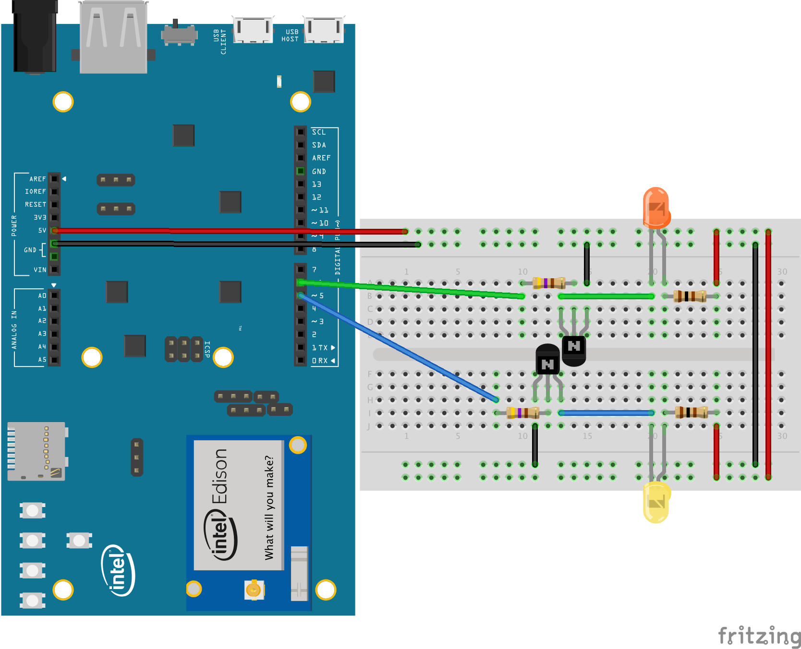

Edison Candle
=============
The Edison Candle is an example of building a production device using a System-on Module
(SoM) running Android Things. This repository contains the application software.
You can find the hardware schematic, layout, and bill of materials (BOM)
[on CircuitHub](https://circuithub.com/projects/androidthings/edison-candle).

Pre-requisites
--------------

- Intel Edison compute module running Android Things
- Android Studio 2.2+

Getting Started
----------------

Connect the Edison compute module to the required peripherals in one of the following ways:

1. Connect the peripherals yourself to an Edison developer kit as shown in the
   [prototype schematic](#prototype-schematic).
2. Fabricate a bare PCB with [OSH Park](https://oshpark.com/) using the design files from
   [CircuitHub](https://circuithub.com/projects/androidthings/edison-candle) and assemble
   the components on the PCB manually.
3. Purchase a fully assembled PCB from
   [CircuitHub](https://circuithub.com/projects/androidthings/edison-candle) directly.

Once you have the peripherals connected to the Edison, download and install the application
using Android Studio.

Prototype Schematic
--------------------

Software License
----------------

Copyright 2017 The Android Open Source Project, Inc.

Licensed to the Apache Software Foundation (ASF) under one or more contributor
license agreements.  See the NOTICE file distributed with this work for
additional information regarding copyright ownership.  The ASF licenses this
file to you under the Apache License, Version 2.0 (the "License"); you may not
use this file except in compliance with the License.  You may obtain a copy of
the License at

  http://www.apache.org/licenses/LICENSE-2.0

Unless required by applicable law or agreed to in writing, software
distributed under the License is distributed on an "AS IS" BASIS, WITHOUT
WARRANTIES OR CONDITIONS OF ANY KIND, either express or implied.  See the
License for the specific language governing permissions and limitations under
the License.

Hardware License
----------------

The hardware design files are released under the
[Creative Commons 4.0 International](http://creativecommons.org/licenses/by/4.0/)
license.
