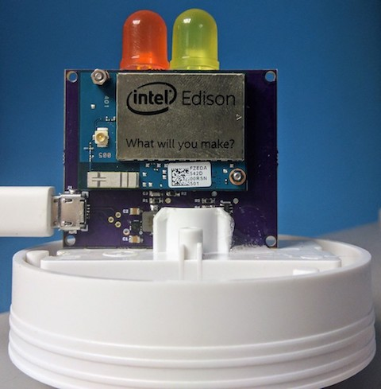

Edison Candle
=============
The Edison Candle is an example of building a production device using a
System-on-Module (SoM) running Android Things.
This repository contains the application software.
You can find the hardware schematic, layout, and bill of materials (BOM) hosted
on [CircuitHub](https://circuithub.com/projects/androidthings/edison-candle).



Prerequisites
-------------

- Carrier board from
  [CircuitHub](https://circuithub.com/projects/androidthings/edison-candle)
- Edison compute module ([SparkFun](https://www.sparkfun.com/products/13024))
- Edison mounting hardware ([SparkFun](https://www.sparkfun.com/products/13187))
- Orange LED ([SparkFun](https://www.sparkfun.com/products/12645))
- Yellow LED ([SparkFun](https://www.sparkfun.com/products/10634))
- Android Studio 2.2+

Getting Started
----------------

1.  Assemble the hardware components
2.  Import the project into Android Studio
3.  Connect the Edison to USB
4.  In Android Studio, click on the "Run" button.

If you prefer to run on the command line, type
```bash
./gradlew installDebug
adb shell am start com.example.androidthings.candle/.HomeActivity
```

Prototype Schematic
--------------------

You may also choose to run the sample on an Edison developer kit, with the
necessary peripherals connected as shown below:


Enable auto-launch behavior
---------------------------

This sample app is currently configured to launch only when deployed from your
development machine. To enable the main activity to launch automatically on boot,
add the following `intent-filter` to the app's manifest file:

```xml
<activity ...>

    <intent-filter>
        <action android:name="android.intent.action.MAIN"/>
        <category android:name="android.intent.category.HOME"/>
        <category android:name="android.intent.category.DEFAULT"/>
    </intent-filter>

</activity>
```

License
-------

Copyright 2017 The Android Open Source Project, Inc.

Licensed to the Apache Software Foundation (ASF) under one or more contributor
license agreements.  See the NOTICE file distributed with this work for
additional information regarding copyright ownership.  The ASF licenses this
file to you under the Apache License, Version 2.0 (the "License"); you may not
use this file except in compliance with the License.  You may obtain a copy of
the License at

  http://www.apache.org/licenses/LICENSE-2.0

Unless required by applicable law or agreed to in writing, software
distributed under the License is distributed on an "AS IS" BASIS, WITHOUT
WARRANTIES OR CONDITIONS OF ANY KIND, either express or implied.  See the
License for the specific language governing permissions and limitations under
the License.
